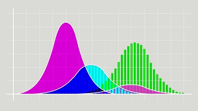

<style>
r { color: #FF5733 } /* bright orange-red */
o { color: #FFA500 } /* orange */
g { color: #4CAF50 } /* green */
b { color: #2196F3 } /* blue */
table { font-size: 11px; }
details { font-size: 14px; }
</style>
<!--- -------Introduction-------- --->
Markdown is a way of writing rich-text content for the web using Plaintext formatting syntax. Plaintext is just the regular alphabet, with a few familiar symbols, like asterisks (*) and backticks (`).  

Formatting text in Markdown has a very gentle learning curve. It doesn’t do anything fancy like change the font size, color, or type. All you have control over is the display of the text—stuff like making things bold, creating headers, and organizing lists.  

In this post, you’ll learn all the Markdown’s major commands that will help you create an awesome **GitHub README**, a **NOTEBOOK**, or a **WEB PAGE** like the one you are reading.  

#### Markdown File Extension

We can create a file with different extensions for markdown files

- markdown
- md
- mkd
- mkdown
- text
- mdown


___

#### Paragraphs 🔠

A paragraph is one or more lines of text followed by one or more blank lines. If you need a hard line break, put two spaces at the end of a line or a backslash followed by a newline

___

#### Horizontal Lines

You can create a horizontal line ( `<hr />` ) by placing 3 or more hyphens "---", asterisks "***", or underscores "___" on a single line by themselves. consistency is a must within a markdown file.

<o>Syntax</o>
  
```text

___

```  
  
<o>Output</o>

___

___

#### Bold and Italics
  
<o>Syntax</o>
   
```text
*italic*  or _italic_  
**bold**  or __bold__  
```  
  
<o>Output</o>
  
*italic*  or _italic_  
**bold**  or __bold__  

___

#### Superscript & Subscript
  
<o>Syntax</o>
  
```text
E=mc<sup>2</sup>  
co<sub>2</sub>  
```
  
<o>Output</o>
  
E=mc<sup>2</sup>  
co<sub>2</sub>  

___

#### BACKSLASH ESCAPES

Markdown provides backslash escapes for the following characters:

\\   backslash  
\`   backtick  
\*   asterisk  
\_   underscore  
\{}  curly braces  
\[]  square brackets  
\()  parentheses  
\#   hash mark  
\+   plus sign  
\-   minus sign (hyphen)  
\.   dot  
\!   exclamation mark  

  
<o>Syntax</o>

```text  
\*How Markdown Is Powering Data Scientist\*
```
  
<o>Output</o>
  
\*How Markdown Is Powering Data Scientist\*

___

#### Headings
  
<o>Syntax</o>
  
```text
# Heading 1
## Heading 2
### Heading 3
#### Heading 4
```  
  
<o>Output</o>
  
# Heading 1
## Heading 2
### Heading 3
#### Heading 4
  
___

#### Lists
  
<o>Syntax</o>
  
```text
*   Item 1
*   Item 2
  * Item 2a
  * Item 2b
```
  
<o>Output</o>
  
* Item 1
* Item 2
  * Item 2a
  * Item 2b

Numbered list, The numbers are incremented automatically in the output.
  
<o>Syntax</o>
  
```text
1.  Item 1

1.  Item 2.
```
  
<o>Output</o>
  
1. Item 1

1. Item 2.

___

#### Links
  
<o>Syntax</o>
  
```text
<http://NestQuest.net>

[Vist My Web Site](http://NestQuest.net)
```
  
<o>Output</o>
  
<http://NestQuest.net>

[Vist My Web Site](http://NestQuest.net)

___

#### Images

Markdown uses an image syntax that is intended to resemble the syntax for links, allowing for two styles: inline and reference.

```text
Inline syntax:


reference syntax:

![Alt text][id]

[id]: url/to/image  "Optional title attribute"
```

<o>Syntax</o>
  
```text

```
  
<o>Output</o>
  


It can also be centered!
  
<o>Syntax</o>
  
```text
{: .mx-auto.d-block :}
```
  
<o>Output</o>
  
{: .mx-auto.d-block :}

```

```


___

#### Boxes

You can add notification, warning and error boxes like this:

###### Notification
  
<o>Syntax</o>
  
```text
{: .box-note}
**Note:** This is a notification box.
```
  
<o>Output</o>
  
{: .box-note}
**Note:** This is a notification box.

###### Warning
  
<o>Syntax</o>
  
```text
{: .box-warning}
**Warning:** This is a warning box.
```
  
<o>Output</o>
  
{: .box-warning}
**Warning:** This is a warning box.

###### Error
  
<o>Syntax</o>
  
```text
{: .box-error}
**Error:** This is an error box.
```
  
<o>Output</o>
  
{: .box-error}
**Error:** This is an error box.

___

#### Tables 
  
<o>Syntax</o>
  
```text
First Header  | Second Header
------------- | -------------
Content Cell  | Content Cell
Content Cell  | Content Cell
```  
  
<o>Output</o>
  
First Header  | Second Header
------------- | -------------
Content Cell  | Content Cell
Content Cell  | Content Cell
  
<o>Syntax</o>
  
Here's a another table:
  
```text
| Number | Next number | Previous number |
| :------ |:--- | :--- |
| Five | Six | Four |
| Ten | Eleven | Nine |
| Seven | Eight | Six |
| Two | Three | One |
```
  
<o>Output</o>
  
| Number | Next number | Previous number |
| :------ |:--- | :--- |
| Five | Six | Four |
| Ten | Eleven | Nine |
| Seven | Eight | Six |
| Two | Three | One |

___

#### Codes Blocks & Inline Code

There are two ways to format code in Markdown. You can either use inline code, by putting backticks (`) around parts of a line, or you can use a code block, which some renderers will apply syntax highlighting to.

Here's an example of a Python Code Block:
  
<o>Syntax</o>
  
~~~text
```codetype
var foo = function(x) {
  return(x + 5);
}
foo(3)
```
~~~
  
<o>Output</o>
  
```
var foo = function(x) {
  return(x + 5);
}
foo(3)
```

And here is the same Syntax with syntax highlighting for python:
  
<o>Syntax</o>
  
~~~
```Python
var foo = function(x) {
  return(x + 5);
}
foo(3)
```
~~~
  
<o>Output</o>
  
```python
var foo = function(x) {
  return(x + 5);
}
foo(3)
```

And here is the same Syntax yet again but with line numbers for python:
  
<o>Syntax</o>

```text
\
var foo = function(x) {
  return(x + 5);
}
foo(3)
\
```
  
<o>Output</o>
  

var foo = function(x) {
  return(x + 5);
}
foo(3)

___

#### Math 🔢
  
<o>Syntax</o>
  